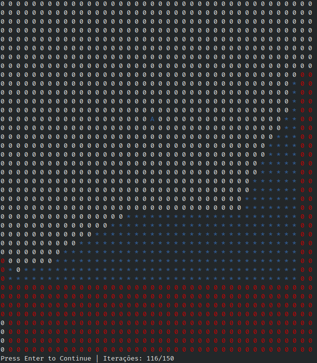
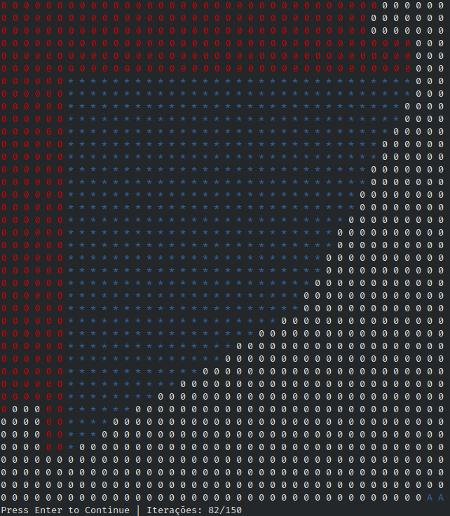
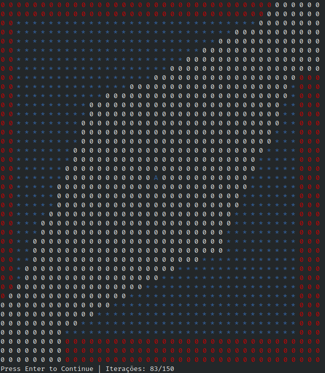
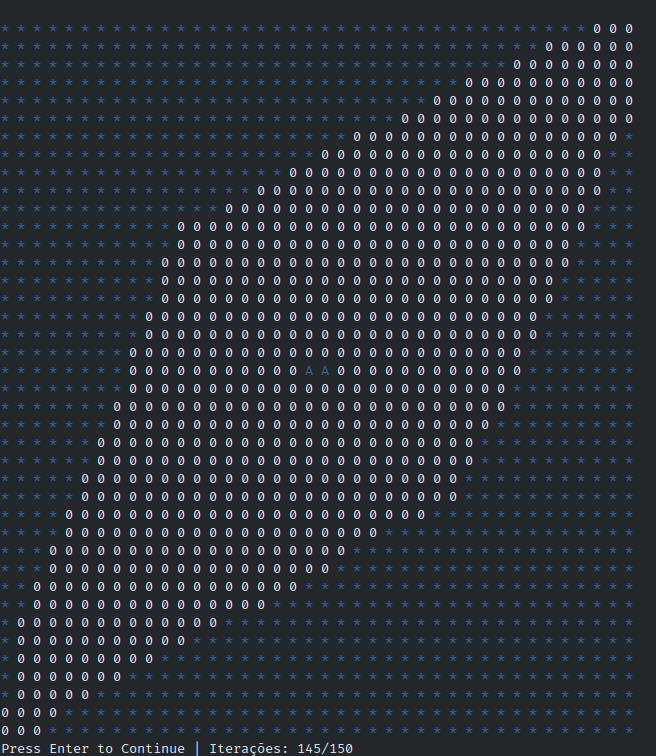

# QuarantineInfected

**Número da Lista**: 1 
**Conteúdo da Disciplina**: Grafos 1 

## Alunos
|Matrícula | Aluno |
| -- | -- |
| 16/0141842  |  [Philipe Rosa Serafim](https://github.com/philipeserafim) |
| 18/0117548  |  [Bruno Carmo Nunes](https://github.com/brunocmo) |

## Video 

https://youtu.be/_tee35JohEs

## Sobre
Devido a crise atual do COVID-19 foi feito uma simulação que mostra a progressão de infectados de um espaço confinado no CLI(40x40). Sendo que os agentes de saúde tem o trabalho de identificar e colocar em quarentena os infectados.
Ambos os casos é utilizado o método de busca em largura (BFS) para a identificação e infecção de nós.

## Instalação
**Linguagem**: C++ 

Feito e usado no kernel: **Linux 5.4.0-45-generic x86_64**

Tenha o *git*, *make* e o compilador *c++* instalado na sua maquina.
De preferência, para não ocorrer problemas, use o Ubuntu.

Para clonar:

`git clone https://github.com/projeto-de-algoritmos/Grafos1_QuarantineInfected.git`

Para compilar o programa:

`make`

Para executar o programa:

`make run`

Para limpar os arquivos .o e bin do programa:

`make clean`

## Uso
Primeiro compile o programa com o `make` e depois execute o programa com `make run` , vai apresentar-se na tela inicial um menu, onde o usuário pode escolher número pré definido de contaminados e agentes de saúde.

Todos as opções(1-7) tem que se definir a taxa de contágio, que vai de 0% a 100%. Quanto mais alta a taxa, mais rápido o virús se espalha.

Ao inicializar o gráfico com o número de interações(150), você pode passar de um por um, ou segurar o botão ENTER para observar a progressão de uma maneira rápida.

Na opção 7, o usúario pode definir 2 infectados íniciais e 2 agentes de sáude inicias. Onde o mesmo tem que prover a posição numa matriz 40x40. Como exemplo o primeiro nó seria 1x1 e o último 40x40.

Na opção 0, tem o término do programa.

## Outros
Quando executar o programa no CLI, use-o em tela cheia para melhor aproveitamento do mesmo.

## Screenshots

